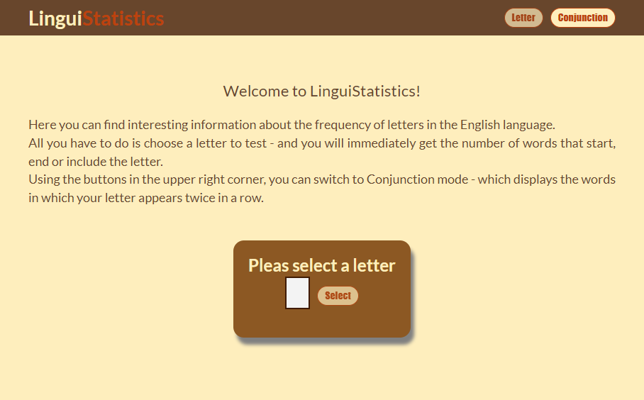
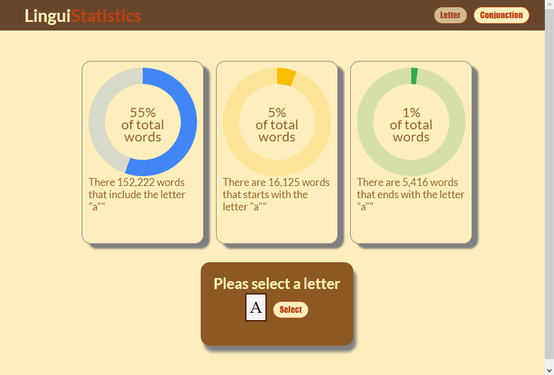

# LinguiStatistics - intro

The LinguiStatistics app allows the user to query the English dictionary.
The user selects a letter, and the app displays data about its frequency - how many words start with this letter, how many words include its double-occurrence, and so on. The display is using a donut graph.

# Install and run

### `Prerequisites:`

- Node V 16.15 or higher
- yarn

### `Installation and running:`

```bash
yarn

yarn start
```

## Important!

The dictionary that the questions refer to is [an-array-of-english-words](https://www.npmjs.com/package/an-array-of-english-words).
This is a package that includes about 270K of English words, and accordingly it is very heavy. The advantage of using the package is extremely high performance speed (since there is no need to turn to an external API). The big disadvantage is the creation of a heavy "build" folder.

# Technologies


This is a `React`-based application (written in `TypeScript`), where all the components are designed with `Emotion.sh`.

The states are managed using `Mobx`.

# Let's get in touch!

You are very welcome to contact me about the project - suggestions, questions, tips,
requests, and of course - information about job offers.

- My mail: [ofertauber@gmail.com](mailto:ofertauber@gmail.com)
- My LinkedIn profile [https://www.linkedin.com/in/ofertauber/](https://www.linkedin.com/in/ofertauber/)

# Scteenshots



